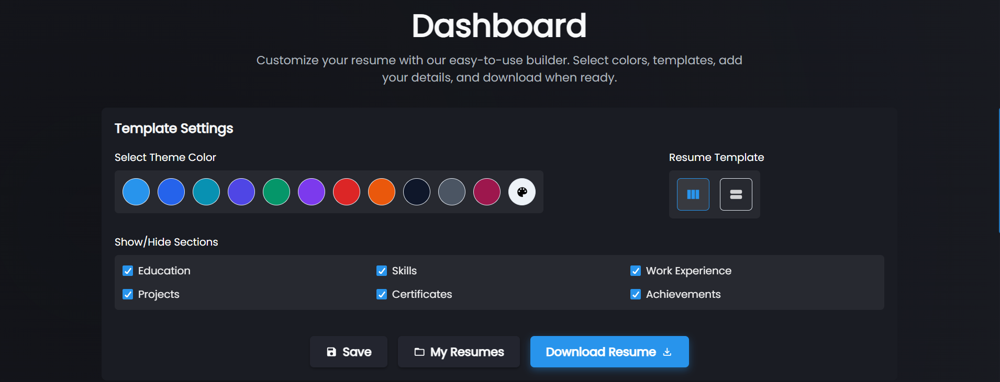

# Quick CV - Fastest Resume Builder


## 📝 Overview

Quick CV is a powerful, intuitive resume builder application that allows users to create professional resumes quickly with beautiful templates. Built with React and Node.js, this application provides a seamless experience for creating, customizing, saving, and exporting resumes in PDF format.



## ✨ Features

- **User-Friendly Interface** - Intuitive step-by-step resume building process
- **Multiple Resume Sections** - Create comprehensive resumes with sections for:
  - Personal information
  - Education
  - Work experience
  - Skills
  - Projects
  - Certificates
  - Achievements
- **Customization Options**:
  - Multiple templates (Divider and Horizontal)
  - Color theme customization
  - Section visibility control
- **Account System**:
  - Create an account to save resumes
  - Access saved resumes from anywhere
  - Edit and update resumes any time
- **Export Options**:
  - Download as PDF
  - Print directly
- **Responsive Design** (with mobile notice for optimal viewing)

## 🚀 Technologies Used

### Frontend

- React.js
- Chakra UI for component styling
- Context API for state management
- jsPDF and html2canvas for PDF generation
- WebFont Loader for custom fonts
- Axios for API requests
- React Icons for UI icons

### Backend

- Node.js with Express
- MongoDB with Mongoose for data storage
- JWT for authentication
- Bcrypt for password hashing
- CORS for cross-origin resource sharing

## 🛠️ Installation and Setup

### Prerequisites

- Node.js (v14 or later)
- npm or yarn
- MongoDB instance (local or Atlas)

### Setup Instructions

1. **Clone the repository**

   ```bash
   git clone https://github.com/yourusername/quick_cv.git
   cd quick_cv
   ```

2. **Install frontend dependencies**

   ```bash
   npm install
   ```

3. **Install server dependencies**

   ```bash
   cd server
   npm install
   cd ..
   ```

4. **Environment Setup**

   Create a `.env` file in the server directory with the following variables:

   ```
   MONGO_URI=your_mongodb_connection_string
   JWT_SECRET=your_jwt_secret_key
   PORT=5000
   ```

5. **Start development servers**
   ```bash
   npm run dev
   ```
   This will start both the frontend (React) and backend (Node/Express) servers concurrently.

## 🧰 Project Structure

```
quick_cv/
├── public/                # Static files
├── server/                # Backend code
│   ├── middleware/        # Authentication middleware
│   ├── models/            # MongoDB schema models
│   └── routes/            # API routes
└── src/                   # Frontend code
    ├── components/        # React components
    │   ├── Auth/          # Authentication components
    │   ├── BuildSteps/    # Resume section builders
    │   ├── Layouts/       # Header and Footer
    │   ├── ResumeTemplates/# Resume layout templates
    │   └── Theme/         # Theme customization
    ├── images/            # Images and icons
    └── services/          # API service calls
```

## 📋 Usage Guide

1. **Getting Started**

   - Navigate to the homepage
   - Start building your resume by filling out the "About" section

2. **Building Your Resume**

   - Use the tabs to navigate between different resume sections
   - Fill out each section with your information
   - Preview updates in real-time on the right side

3. **Customizing Your Resume**

   - Choose between different templates
   - Change the color theme
   - Show/hide specific sections

4. **Saving Your Work**

   - Create an account or log in
   - Click the "Save" button to save your resume
   - Give your resume a title

5. **Exporting Your Resume**
   - Click the "Download" button to export as PDF
   - Use the print functionality for a hard copy

## 🔒 Authentication and Data Storage

- User credentials are securely stored with password hashing
- JWT (JSON Web Tokens) used for authentication
- Resumes are stored in MongoDB and associated with user accounts
- Warning dialog prevents accidental data loss for non-authenticated users

## 🤝 Contributing

1. Fork the repository
2. Create a feature branch (`git checkout -b feature/amazing-feature`)
3. Commit your changes (`git commit -m 'Add some amazing feature'`)
4. Push to the branch (`git push origin feature/amazing-feature`)
5. Open a Pull Request

## 📞 Contact

If you have any questions or suggestions, please reach out:

- Email: akshat3144@example.com